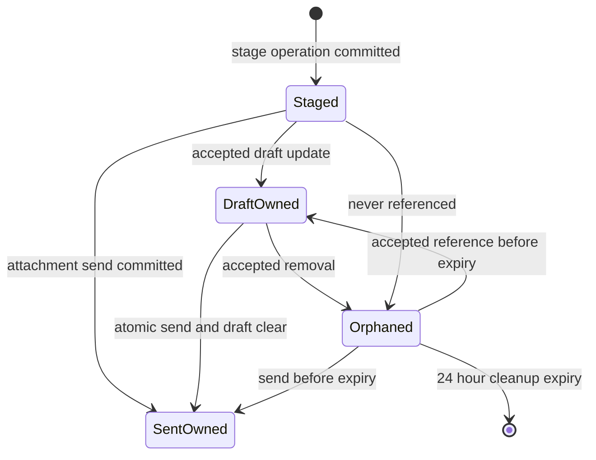

# Persistent image attachment contract

Historical run records named below are held privately under
[#99](https://github.com/mcgloneb/ai-chat/issues/99). They are not files in this
checkout or acceptance evidence for a new build. Preserve their dated results
and limitations; record new sanitized acceptance on the owning open issue.

Contract version: 1. This is the shared C2 interface consumed by the browser,
terminal and historical-retrieval work in issues #33, #34 and #35.

## Product limits and identity

The pilot accepts complete PNG (`image/png`) images. The host validates magic
bytes, declared media type and dimensions before staging. PNG structure, chunk
checksums and bounded inflation are validated. Each image is at most 1 MiB, each
message or draft contains at most four images and their aggregate raw size is at
most 3 MiB.
Width and height are each at most 4096 pixels and the image is at most 16,777,216
pixels. A native batch also carries at most 3 MiB of raw images, so separately
valid queued messages split across turns when needed. The native image parts
plus 256 KiB of envelope headroom must fit the existing 8 MiB provider frame
limit, and the adapter checks the complete serialized native request before
sending it.

An attachment reference contains only:

```ts
interface AttachmentMetadata {
  id: string; // att- plus 32 lowercase hexadecimal characters
  filename: string; // display data, at most 255 UTF-8 bytes
  mediaType: 'image/png';
  byteSize: number;
  width: number;
  height: number;
}
```

The ID is opaque, host-issued and scoped to one saved session. A filename is
never a path, resolver input or authority. The host keeps the SHA-256 content
identity in its attachment index and verifies it whenever bytes are resolved.
Different references may share one content-addressed blob. Intentional reuse of
an existing reference is allowed; reference identity and send-operation identity
have separate meanings.

## Staging, draft and command operations

`RoomController.stageAttachment` is the shared staging entry point. It accepts
`{sessionId, operationId, filename, mediaType, bytes}`. Both identities are UUIDs.
It returns `AttachmentMetadata` after validation and an atomic host-side write.
Repeating an operation with equivalent normalized filename, validated media type
and content returns the same reference. Reusing it with different input returns
`attachment-conflict`.

The browser maps this operation to:

```text
POST /api/attachments?sessionId=<uuid>&operationId=<uuid>&filename=<encoded display name>
Content-Type: image/png
Body: raw image bytes
```

The route is dispatched before the JSON reader, enforces the limit while reading
and returns `{attachment}` with status 201. It shares the existing authenticated,
same-origin `/api/` boundary. C4 supplies file or clipboard bytes to the same
controller method; it does not pass a file path into this contract.

Saved draft text remains in `Session.composerDraft` for compatibility. Ordered
references live in `Session.composerAttachments`; `composerDraftRevision` is the
optimistic concurrency value and `composerDraftVersions` retains up to 1000
per-client clocks across restart. `/api/draft` accepts the existing fields plus
optional `attachmentIds` and `baseRevision`. An attachment update must match the
current base revision. A stale version is ignored and reported with
`accepted=false`; a stale base revision returns 409. Text-only legacy updates do
not alter attachment references. These rules prevent another client from clearing
or resurrecting accepted references.

`WebCommand` and `RoomController.submit` accept ordered `attachmentIds`. The
field is omitted for a text-only command and, when present on a command, must be
nonempty; draft removal continues to use `attachmentIds: []` on the draft
operation. A send with attachments uses the command UUID as its durable operation ID. When it also
names a draft client/version/base revision, clearing the draft references and
committing the message, ordered metadata and operation record occur in the same
atomic session save. A failed commit leaves the draft untouched. A send must
contain text or at least one attachment.

Leading addressing, broadcasts and reply recipient inheritance are unchanged.
`/reply #message-id [@agent ...]` may omit its caption when attachments are
present. Attachments may accompany ordinary messages and `/reply`; other slash
commands reject them. An image-only session preview is `[Image: filename]`.

The send input identity hashes the exact caption/address text, reply target and
ordered attachment IDs. A successful message stores `{id,inputHash}` in
`Message.attachmentOperation`. Replaying equivalent input after a lost
acknowledgement, reconnect or host restart returns that message and cannot create
a second commit. The browser forwards every command UUID for lookup, even when a
later request omits the attachment field, while new text-only commands retain no
durable operation record. This lookup runs before draft clearing and before any
slash-command side effect. Changed input under the same operation ID conflicts.
Failed pre-commit work has no operation record and can be retried; the browser does not
retain a launch-local failed result for such an operation. This bounded record
applies to attachment sends only and does not change text-only retry semantics.

### Composer submission result

`RoomController.submitDraft` is the shared composer submission entry point for
HTTP commands, terminal text and terminal attachment sends. It owns operation
validation before clearing, capture of the original room and recovery facts,
text-draft clearing, dispatch, attachment commitment classification and guarded
recovery, and it returns a `DraftSubmissionResult` declared in `src/web-types.ts`
next to `CommandResult`. The type is JSON-safe and browser-importable; the
server and terminal import it type-only. Callers consume it instead of scanning
message history, comparing draft counters or reading persistence.

```ts
interface DraftSubmissionResult {
  dispatch:
    | { status: 'sent' }
    | { status: 'failed'; failure: 'command-error' | 'operation-conflict'; error: string };
  commitment:
    | { status: 'not-applicable' }
    | { status: 'uncommitted'; operationId: string }
    | { status: 'committed'; operationId: string };
  recovery:
    | { status: 'not-needed' }
    | { status: 'restored' }
    | { status: 'skipped'; reason: 'newer-draft' | 'conversation-changed' | 'ineligible' }
    | { status: 'failed'; error: string };
  sessionId: string;
}
```

The four facts are independent. `dispatch.sent` means command execution
returned, not that any agent received or answered a message. `commitment` is
read by operation ID from the room the queued dispatch ran against, as soon
as the dispatch settles and whatever was selected before or since. So
`committed` also names an operation committed by an earlier attempt and may
accompany a failed dispatch; a text send reports `not-applicable`. A dispatch
the queue refused before it ran wrote nothing itself, but the fact still
describes the target session's record, which an earlier attempt may have
written: it is read from a live room holding that session, else from the saved
session. A saved session that cannot be read fails the submission instead of
reporting `uncommitted`. `recovery` is `not-needed` after
successful dispatch and `restored` only after the qualifying write completed;
`skipped` names why no write ran, and `failed` keeps the recovery error apart
from the command error. `sessionId` is the controller's selected session when
the operation completed, including after a switching command or its failure.

Valid combinations include a successful submission (`sent` / `not-applicable`
or `committed` / `not-needed`); a failed text send restored (`failed` /
`not-applicable` / `restored`); a failure whose restoration was skipped for a
newer draft or a changed conversation; a failed restoration (`failed` /
`failed`, with both errors retained); and a dispatch error after attachment
commitment (`failed` / `committed`). A reused operation ID with different input
reports `failure: 'operation-conflict'`, which HTTP maps to 409 before any draft
is cleared or restored.

Each caller keeps its previous capture points and queue boundaries:

| Caller               | Clear                                                                                                                                                                                | Recovery on failed dispatch                                                                                                                                                                                                                                                                                                                                                                                                                                                               |
| -------------------- | ------------------------------------------------------------------------------------------------------------------------------------------------------------------------------------ | ----------------------------------------------------------------------------------------------------------------------------------------------------------------------------------------------------------------------------------------------------------------------------------------------------------------------------------------------------------------------------------------------------------------------------------------------------------------------------------------- |
| Terminal text        | Original room and pre-clear revision captured, then an unversioned `''` write, all synchronous before the queued dispatch.                                                           | Unversioned write of the submitted line only while the same room is selected and the revision is exactly the captured revision plus one. A higher revision is `skipped` for `newer-draft`; a different room is `skipped` for `conversation-changed`. `TerminalUI` presents the result; it decides no recovery.                                                                                                                                                                            |
| HTTP text            | Queued validation, then the queued versioned clear of `''` for the client version, then the queued dispatch. A stale clear reports `accepted: false` and does not stop the dispatch. | When the selected session still matches and the client's recorded version equals the submitted version, a queued unversioned write of `input.line`, which advances the revision without advancing that client's version. A recorded higher version is `skipped` for `newer-draft`; a queued write refused because the conversation changed after the guard passed is `skipped` for `conversation-changed`; other unmet conditions are `ineligible`. No draft identity means `ineligible`. |
| HTTP attachments     | No pre-clear; `Room.send` clears the draft inside its atomic commit.                                                                                                                 | The same session and version guard, then a queued unversioned re-save of the current text, which advances the revision. The guard does not prove commitment: a same-version stale rejection also qualifies and reports `restored` with `uncommitted`.                                                                                                                                                                                                                                     |
| Terminal attachments | No pre-clear.                                                                                                                                                                        | None. Every failure is `skipped` for `ineligible`, including a committed operation the terminal acknowledges. Uncommitted failure keeps the pending operation identity for an unchanged retry.                                                                                                                                                                                                                                                                                            |

The HTTP command response carries the result as `CommandResult.submission`;
`ok`, `error` and `sessionId` keep their meanings and status mapping. The
request cache retains every result, including text failures, except that it
deletes the entry after an uncommitted attachment failure so the same identity
can retry without becoming a new delivery. A refused retry of work an earlier
attempt already committed therefore reports `committed` and its failure stays
cached; the consumer reads that fact rather than dispatching again. A
submission that produces no typed result at all, such as one whose saved
session could not be read, is not retained, so the same identity is evaluated
again on retry.

## Lifecycle and recovery

Bytes live under host-controlled per-session attachment storage, outside
`session.json`; the [saved format contract](saved-format-contract.md) owns
`session.json` itself and the workspace-directory recovery unit these bytes
belong to. Staging writes a content-addressed blob and index atomically.
The saved draft and saved messages are the authoritative ownership set:



The store reconciles ownership after saves and on startup. A crash after staging
leaves recoverable staged ownership. A crash before the session commit leaves no
message; the same operation can retry. A crash after the atomic session commit
but before acknowledgement leaves the message and operation record, so replay
returns the existing message. No separate ownership update is required after the
session commit. Missing or corrupt bytes produce `attachment-corrupt`; the room
does not claim pixel delivery.

Cleanup runs when the workspace store is acquired, before staging and through the
explicit `cleanupAttachments` maintenance seam. Unreferenced staging and blobs
expire after 24 hours. Interrupted temporary writes expire after one hour. A
reference removed from a draft becomes orphaned at removal time. Cleanup scans
every saved session, including inactive sessions, and preserves any blob used by
any live message or draft reference. An unreadable session fails safe and is not
cleaned. This contract adds no session-deletion operation.

## Authenticated byte reads and resolver settings

Browser bytes are read from:

```text
GET /api/attachments/<attachment-id>?sessionId=<uuid>
```

Bearer authentication and same-origin checks run before lookup. Browser images
are fetched with the bearer header and displayed through temporary blob URLs;
the browser revokes those URLs when an image changes or unmounts.
The session-scoped resolver rejects invalid, unknown and cross-session IDs without
returning bytes. Success returns the validated media type, exact content length,
`Cache-Control: no-store`, `X-Content-Type-Options: nosniff` and a SHA-256 ETag.

Every tool-hosting construction path receives this host-only setting:

```ts
interface AttachmentResolverSettings {
  directory: string; // supplied by the host, never an agent argument
  sessionId: string;
}
```

It is present in Claude's host `ToolService` and separate MCP configuration,
Codex's in-process `ToolService`, and the isolated runtime used by Grok and
Antigravity. The separate MCP process accepts it in its strict settings parser
and constructs `FileAttachmentResolver`. C2 does not register a tool. C5 will
authorize an ID against the current turn's full public-history snapshot before
calling this resolver and will own native tool-result mapping and discovery.
The resolver accepts attachment identity only; no task filesystem or network
permission is expanded.

## Serialization and initial native delivery

Session JSON, browser state/SSE and saved drafts contain metadata references and
never bytes or base64. Existing prompt envelopes, digests, checkpoints,
`read_conversation` projections and ordinary text tool results remain byte-free.
C5 owns attachment discovery in those projections.

C2 initial delivery considers only the required messages in the current adapter
turn. Reply targets do not automatically resend pixels. For each required message,
Grok receives a host-generated text association naming the message and attachment
IDs immediately followed by the native image part, preserving message order and
attachment order. Metadata and bytes are resolved and integrity-checked at that
boundary. Unsupported adapter tuples fail with an accurate unavailable delivery;
metadata is never treated as delivered pixels.

The room classifies that support per recipient at its live adapter before any
provider attempt. An adapter without an initial-image route, or a Grok adapter
outside its observed runtime contract or room policy, has only its image-bearing
deliveries saved as `failed`, with no provider attempt ID and a byte-free
per-recipient `Delivery.rationale` naming the missing route or each failed or
missing condition from live effective state: room permissions, skills and
command mode, the runtime contract and the native inventory. The live CLI build
and the observed model are appended as diagnostics; since #105 neither the
requested nor the observed model is a condition. That
rejection reserves no attempt, charges no exchange budget, calls neither
`adapter.run` nor `adapter.close`, and leaves the connection ready, so text-only
messages to the same recipient continue in order and other recipients keep their
own outcomes. The message keeps its attachment references; an explicit `/retry`
re-evaluates the live gate, failing again with the same reason while the tuple is
unchanged and delivering after a genuine enablement change. Grok's in-adapter
guard shares this diagnostic and is reached only when the preflight was bypassed;
it reports an invariant violation, not a separate CLI-version explanation. Actual
provider failures keep the existing failure path. Later byte-free projections may
still mention the failed message and its attachment metadata; no path treats that
as pixel delivery.

The historical C2 initial tuple is Grok Build 1.0.13
(`5e9a58528b76`) with requested model `provider default` and observed model
`grok-4.6`, under `edits=false`, `commands=false`, `network=false`, skills
disabled, the isolated native profile and exact room MCP inventory. The room restrictions remain in place for that build; since #105 the model is evidence only. A policy mismatch leaves initial images
unavailable while preserving text support. The separately verified Grok 1.0.30 image mapping, required room coverage and current rerun commands are documented in
[image support](image-support.md#grok-1030-image-coverage). Since #69 a newer Grok CLI is gated by the [observed runtime contract](image-support.md#grok-observed-runtime-contract-and-1034-coverage-issue-69), not by its version. Effort is recorded as a test configuration and native observation, not an image gate. The historical Codex C1 result remains unverified under its original one-root
criterion. The separately accepted fresh-thread Codex mapping and revised policy
disposition are documented in [image support](image-support.md#codex-native-image-mapping). Claude's older
2.1.257 result remains historical. Since #85 a newer Claude or Codex CLI is
decided by the same live requirements as a recorded one, not by its version. The
approved Claude mapping, text-turn
identity prerequisite and rerun procedure are documented in
[image support](image-support.md#claude-native-image-mapping).
Antigravity connects on any version whose startup enforcement probe observes the room policy hook denying the selected profile's native write, and Antigravity images are unsupported in this release on any version. Cold-resumed Codex image paths remain unavailable. [Image release status](compatibility.md#image-release-status-issue-58) lists the configurations that are enabled now.

The C2 native-initial acceptance record (`persistent-image-initial-2026-09-12.json`, private historical record)
passed through `RoomController.stageAttachment` and `RoomController.submit` at
source baseline `5c929b648a19adb3964c712d3b6b4c40243dfd44`. It retains the exact
adapter tuple, restricted policy, provider and attachment identities and the
private whole-field visual comparison result without retaining the answer or
image bytes.

This record covers initial delivery only. Persistent support for any tuple remains
incomplete until C5 also passes fresh-session historical retrieval through its
actual bridge. Registration, metadata availability or this initial mapping alone
does not establish persistent image support.

## Error codes

The shared store uses bounded errors: `attachment-invalid` for malformed input or
MIME mismatch, `attachment-unsupported` for unsupported/undecodable formats,
`attachment-limit` for byte/count/dimension/frame limits, `attachment-conflict`
for changed operation input, `attachment-not-found` for unknown or cross-session
identity and `attachment-corrupt` for missing or hash-mismatched host bytes. HTTP
maps these to 400, 415, 413, 409, 404 and 409 respectively and never includes image
bytes in an error body.

## Historical retrieval and discovery

C5 registers `read_attachment({attachment_id})` in the shared registry. Its input
is strict and accepts only an `att-` ID with 32 lowercase hexadecimal digits.
Neither path/URL inputs nor an agent-selected bridge are accepted. The host
resolves bytes with the C2 session resolver, after finding the reference in the
current turn's full public history. Addressing another participant does not hide
a public attachment. A summary, required-message list or reply target never
grants authority.

`ToolService.setHistory` writes an atomic metadata-only snapshot. A separate
host-owned `attachmentTurnFile`, forwarded in strict MCP settings, records the
active turn revision, room session and trusted retrieval bridge. Adapters begin
the turn after updating history and end it on completion. Interruption,
maintenance and close revoke the turn. MCP reads that state at call time and
checks it again, alongside current history membership, immediately before native
serialization. Replacement invalidates the old revision; a closed/replaced host
cannot authorize its former MCP process. Grok closes the provider process on
interruption, so its old MCP connection cannot issue work into the next turn.

`AttachmentResult` keeps bytes in private fields and rejects JSON serialization.
The MCP boundary emits a text association containing message ID, attachment
metadata and content hash, followed by an MCP `image` item. It revalidates C2 PNG,
size, dimension and hash constraints and reserves 256 KiB of enclosing transport
headroom below the 8 MiB frame limit. Missing/corrupt bytes and unavailable bridges
produce bounded byte-free errors. Ordinary text tools retain their result shapes.
Codex's ordinary text constructor still refuses typed images. Its dedicated
in-process response boundary unwraps `codex-dynamic-image` results only after
checking current thread/turn authority and accepted support. Final serialization
checks the full response, then rechecks authority immediately before dispatch.

The shared inventory reaches Claude MCP, Codex dynamic tools, Grok isolated MCP
and Antigravity's `call_mcp_tool` hook. Grok, Claude and fresh-thread Codex have
registered native retrieval bridges, decided by their live observations.
Cold-resumed Codex remains unavailable and Antigravity images are unsupported in this release; shared registration is not an image-capability declaration. There is no new Antigravity
version allowance or native image-generation/filesystem permission.

Public-message projections preserve ordered metadata in normal context, required
messages, reply targets, consultation context, extractive digests, checkpoint
chunks and bounded seed tails. Larger digests fall back to pagination guidance.
The seed and every normal turn retain a bounded `read_conversation` discovery
pointer even when old metadata is absent. Exact and paginated history reads
return the full public metadata snapshot, including messages behind
`contextThrough`. None of those projections replays pixels.

### Current visual evidence

The C5 acceptance record (`persistent-image-retrieval-2026-09-12.json`, private historical record)
reverifies initial delivery and fresh-session retrieval on Grok Build 1.0.13
(`5e9a58528b76`), requested model `provider default`, observed `grok-4.6`, with
all task permissions false, skills disabled and the existing isolated profile.
The fixture was synthetic randomized color panels generated in host memory.
Both independent whole-field visual assertions passed.

The retrieval room used C2 staging and sending to save an image addressed to
human. It had no earlier visual answer. An intentionally lossy, schema-valid saved checkpoint
and enough later text to exhaust the recent-tail budget exercised the real
`/reconnect @grok` replacement and `contextThrough` update. The new provider
received neither the older attachment ID nor pixels in its seed/inline prompt.
The observed tool sequence was `read_conversation(offset=0, limit=50)`, then
`read_attachment` with the discovered ID. The separate MCP response contained
an `image/png` item matching the host content hash, under the active room session.
No image bytes or private assertion answer are retained in the JSON evidence.
The saved checkpoint contains a benign attributed entry and survives a
SessionStore load round-trip. It is an acceptance fixture, not a claim about
generated summary quality; host tests separately exercise both large digest thresholds.

The browser-origin acceptance record (`persistent-image-browser-2026-09-13.json`, private historical record)
repeats both paths through the integrated browser flow at source baseline
`1fdeebcc319b2c6ee83dd4a9d5a0d94f024fd326`, after the per-recipient image
preflight landed. A headless Chromium 153 opened the served web UI, the fixture
was pasted into the composer, uploaded by the page with a `201` response, and
sent through `/api/command` with its attachment identity as the command id; the
resulting message carried the attachment operation. The initial answer and the
fresh-session answer both passed the private whole-field visual assertion and
rendered in the page. The retrieval room was created with the browser's own new
conversation control, its image was addressed to human through the page, and the
fresh provider session came from the browser's `/reconnect @grok` and
`/continue @grok` under the same lossy saved checkpoint fixture. Grok's live
gate reported available under the restricted policy for both rooms. The
observed tool sequence was again `read_conversation` then `read_attachment`
returning the host content hash. Neither the browser state snapshot, the upload
responses, the saved sessions nor the seed contained image bytes or the older
attachment ID. One earlier run passed the same checks and failed only its own
evidence assertion, since fixed; its output was not retained.

Run `npx tsx scripts/live-attachment-retrieval.ts --adapter grok --room restricted` for the opt-in
controller-path live acceptance, or
`npx tsx scripts/live-browser-attachment.ts --adapter grok --room restricted` for the
browser-origin variant, which uses `CHITTR_BROWSER` or the installed Chrome. It uses existing Grok subscription login. Its transparent MCP
observer forwards responses unchanged and records only IDs, hashes, sizes and
boundary events. Disposable room state remains in the printed scratch directory;
copy only `evidence.json` into a delivery record, never native transcripts or
attachment blobs.

The mapping uses the installed MCP SDK's `ImageContentSchema` and
`CallToolResultSchema`, the installed Grok binary's MCP `ContentBlock` image
variant, and the standard [MCP image result schema](https://modelcontextprotocol.io/specification/2025-11-25/schema).
Grok's documented [MCP integration](https://docs.x.ai/build/features/mcp-servers)
names the provider bridge. Schema support alone did not enable it; the correlated
native response and private visual assertion above establish the accepted tuple.
The epic can consume this history/discovery contract through the browser and
terminal composition paths without adding another store or initial mapping.

Shared support reports, bounded CLI identity diagnostics, adapter/model/effort/policy script options,
and the provider tickets' local staging procedure are in [image support](image-support.md).
Stage new source files before running so automatic commit/patch evidence covers the whole tree.
